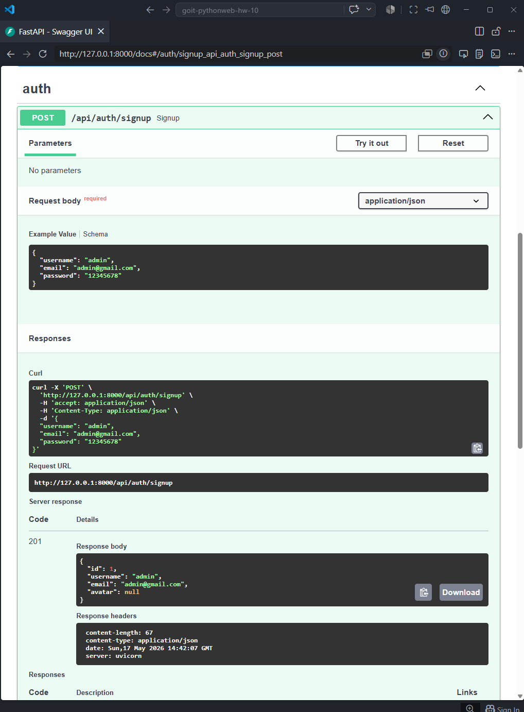
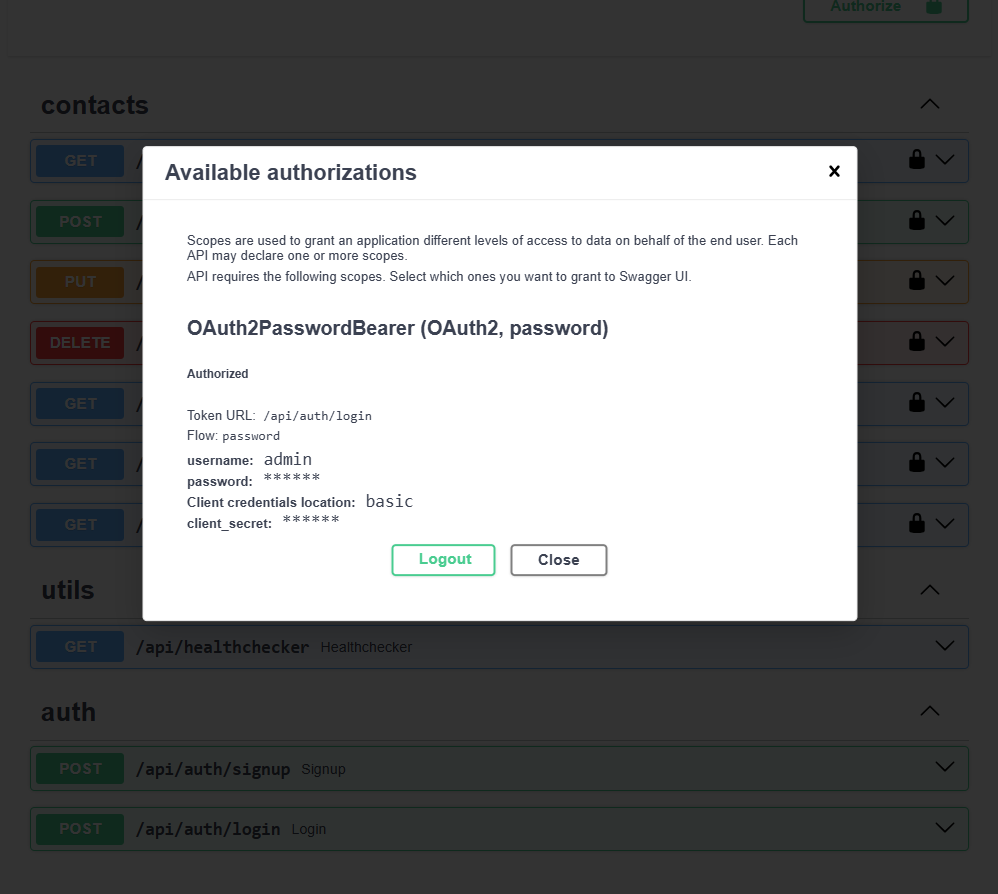
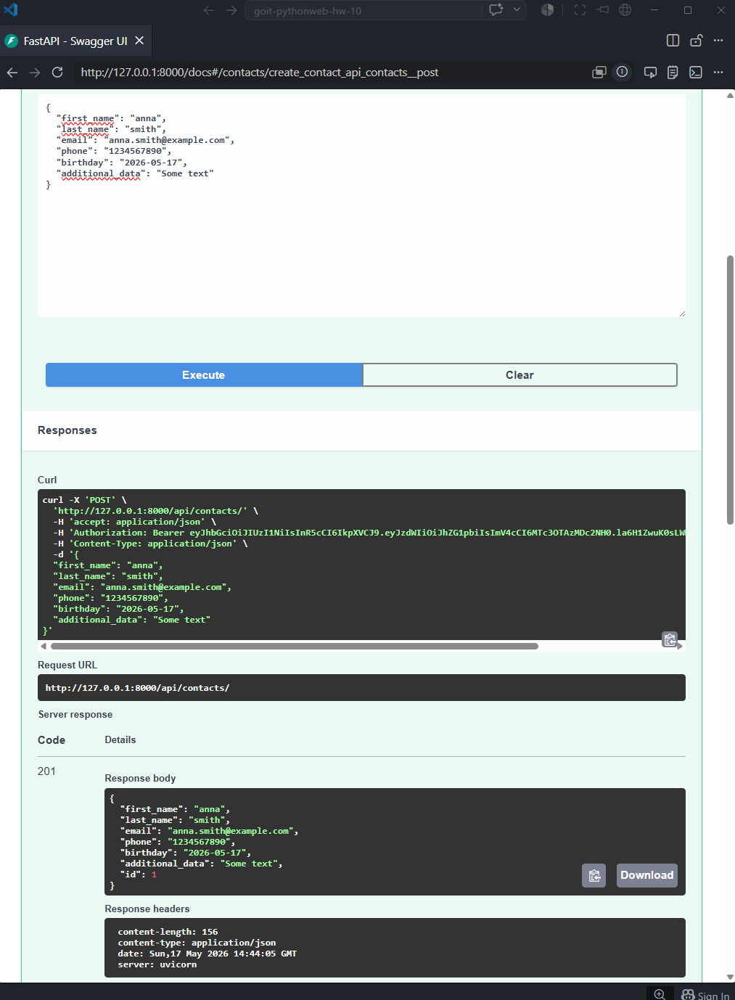
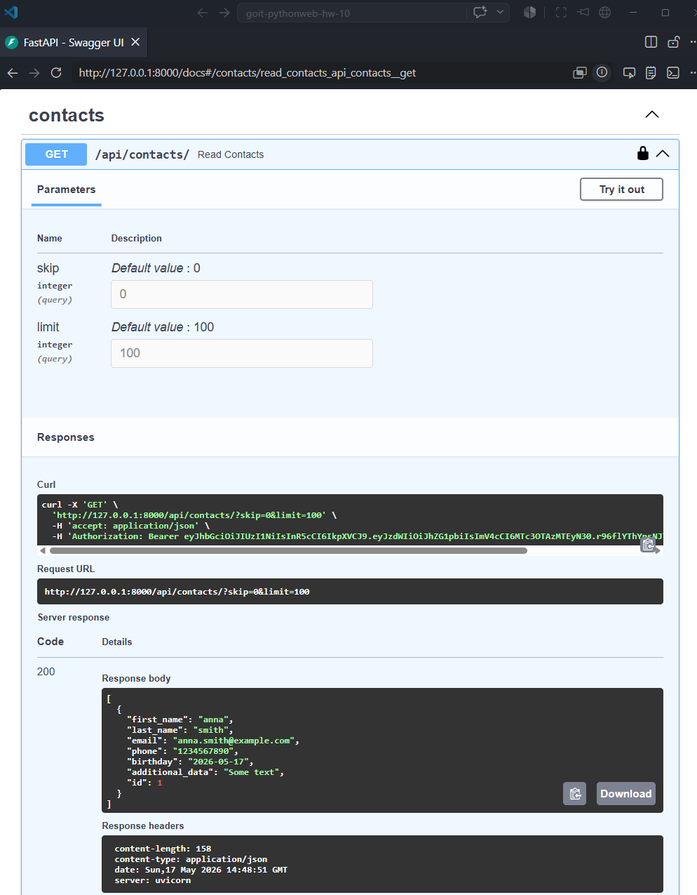
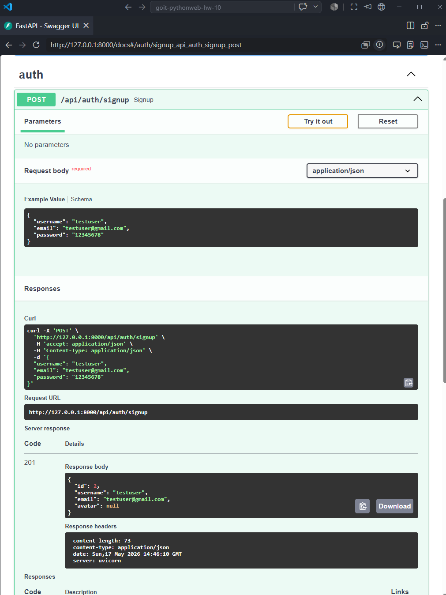
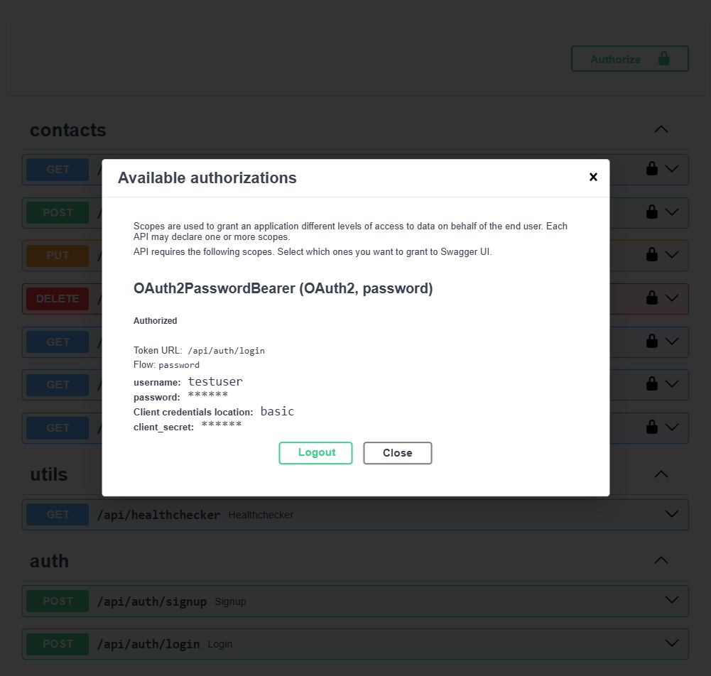
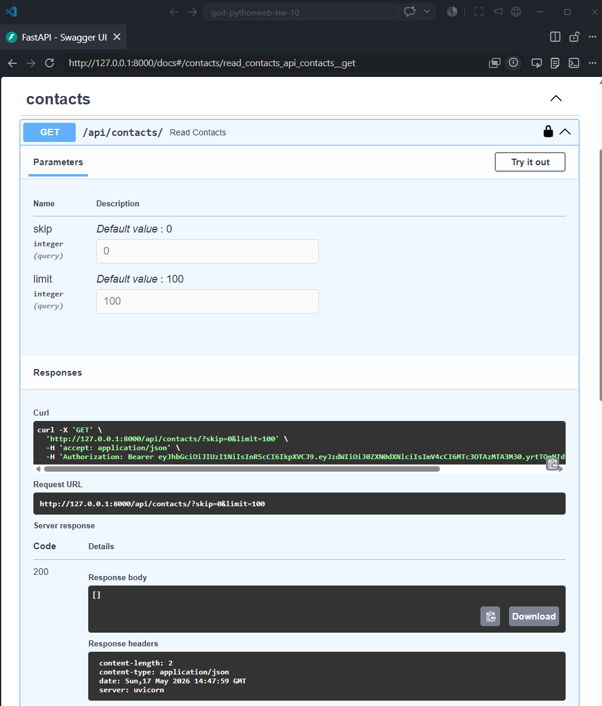

# REST API Contacts App (FastAPI)

REST API application with authentication, contacts management, email verification, and avatar upload.

---

## Features

- User registration & authentication (JWT)
- Email verification
- Contacts CRUD (user-specific isolation)
- Search contacts
- Upcoming birthdays
- Rate limiting (/me endpoint)
- Avatar upload (Cloudinary)
- CORS enabled

---

## Technologies

- FastAPI
- PostgreSQL + SQLAlchemy (async)
- JWT (python-jose)
- Passlib (bcrypt)
- Cloudinary
- SlowAPI (rate limiting)
- Docker + Docker Compose. Includes: FastAPI app, PostgreSQL database

---

## Installation

### 1. Clone repository
```bash
git clone <repo_url>
cd goit-pythonweb-hw-10
```

## Create .env file

```bash
DB_URL=postgresql+asyncpg://postgres:password@db:5432/contacts

SECRET_KEY=your_secret
ALGORITHM=HS256

CLOUDINARY_NAME=xxx
CLOUDINARY_API_KEY=xxx
CLOUDINARY_API_SECRET=xxx
```

## Run Docker

```bash
docker-compose up --build
```

---

## Auth

### Signup

- POST /api/auth/signup

Example:


### Login

- POST /api/auth/login
Enter username and password

As a result you will see status and data of auth

Example:


Returns:
```bash
{
  "access_token": "jwt_token",
  "token_type": "bearer"
}
```

If you try to add new contact after auth, it will be visible for you but not for other users

1. Add new contact 



2. With **GET /api/contacts/** get your contact list to see recently created contact. 



3. Create new user



4. Login under new username 



5. Try to search for available contacts under new username.



---

## User endpoints

- GET /api/users/me
- PATCH /api/users/avatar

## Contacts

- CRUD /api/contacts
- Search /api/contacts/search
- Birthdays /api/contacts/birthdays

## Avatar upload

### Send multipart/form-data:
```bash
file: image.jpg
```

---

## Author

Project author: GoIT Neoversity
Student: Olha Fursova
